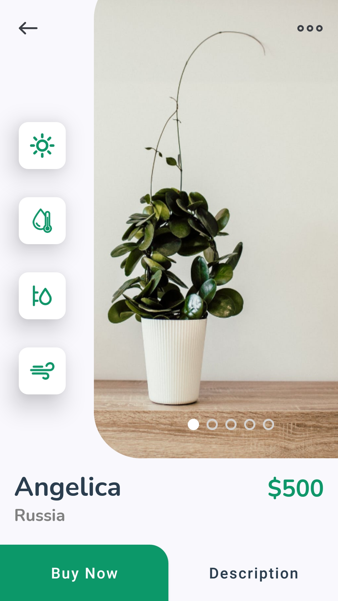

# Plant App UI

[](https://www.android.com)
[](https://www.apache.org/licenses/LICENSE-2.0.html)
[](https://docs.gradle.org/current/release-notes)
[](https://java-lang.github.io/awesome-java)

☘️ A beautiful Plant App UI written in Java for android with examples.

# Source
Repo to demonstrate Plant App UI in Android app. This is a follow up on the source at :

- [Plant App Flutter UI](https://www.youtube.com/watch?v=LN668OAUrK4&feature=youtu.be)
- [AndroidMultipleViewRecyclerView](https://github.com/uigitdev/AndroidMultipleViewRecyclerView)
- [Flat Icon](https://www.flaticon.com)

# Demo App

<p align="center">
  <a href="https://github.com/achmadqomarudin/Plant-App-UI/releases/latest/download/app-demo.apk">
    
  </a>
</p>

<table style="width:100%">
  <tr>
    <th>Example 1</th>
    <th>Example 2</th>
  </tr>
  <tr>
    <td></td>
    <td></td>
  </tr>
  <tr>
    <th>Example 3</th>
    <th>Example 4</th>
  </tr>
  <tr>
    <td></td>
    <td></td>
  </tr>
</table>

# License

```
    Copyright (C) Achmad Qomarudin

    Licensed under the Apache License, Version 2.0 (the "License");
    you may not use this file except in compliance with the License.
    You may obtain a copy of the License at

       http://www.apache.org/licenses/LICENSE-2.0

    Unless required by applicable law or agreed to in writing, software
    distributed under the License is distributed on an "AS IS" BASIS,
    WITHOUT WARRANTIES OR CONDITIONS OF ANY KIND, either express or implied.
    See the License for the specific language governing permissions and
    limitations under the License.
```